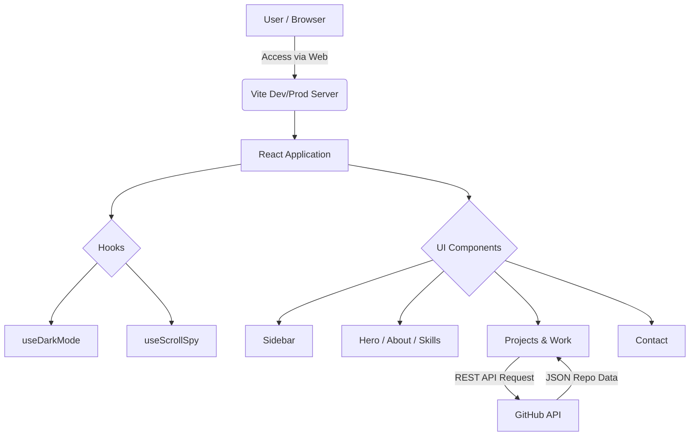

<div align="center">
  <h1 align="center">Nguyen Tan Nha Portfolio</h1>
  <p align="center">
    A modern, high-performance, and responsive personal developer portfolio built with React, Vite, and Tailwind CSS.
  </p>
</div>

## 📖 Introduction
Welcome to the repository for **Nguyen Tan Nha's Personal Portfolio**. This application is designed to showcase my skills, education, work experience, and projects in a sleek, accessible, and highly optimized web interface. 

Leveraging the power of **React**, **Vite**, and **Tailwind CSS**, it features a clean dark-themed design system, dynamic GitHub project fetching, and smooth micro-animations. It’s built not just as a resume, but as a demonstration of modern frontend development best practices.

## ✨ Key Features
- **Dynamic Project Fetching:** Automatically fetches and displays public repositories directly from the GitHub API.
- **Smart Sorting & Filtering:** Intelligently categorizes and prioritizes professional, English-titled projects over university assignments.
- **Responsive "Load More" Pagination:** Optimizes performance by limiting initial project rendering.
- **Modern UI/UX & Dark Mode:** Integrates a sophisticated dark theme toggle with WCAG accessibility guidelines in mind.
- **Scroll Spy Navigation:** Highlights the active sidebar navigation item based on the user's scroll position.
- **Vibrant Micro-animations:** Uses Tailwind CSS keyframes for subtle, engaging element transitions.

## 🏗 Overall Architecture



## 🚀 Installation

To get this project running on your local machine, ensure you have **Node.js** installed (v18 or higher recommended).

1. **Clone the repository:**
   ```bash
   git clone https://github.com/NguyenTanNHa/Portfolio-Nguyen-Tan-Nha.git
   ```
2. **Navigate to the directory:**
   ```bash
   cd Portfolio-Nguyen-Tan-Nha
   ```
3. **Install dependencies:**
   ```bash
   npm install
   ```

## 💻 Running the project

Start the local development server with Hot Module Replacement (HMR):

```bash
npm run dev
```

Your app will be available at `http://localhost:5173`. 

To build for production:

```bash
npm run build
```

To preview the production build locally:

```bash
npm run preview
```

## ⚙️ Env configuration

Currently, this project relies on public APIs (like GitHub's public repository API) which do not strictly require authentication for basic usage. 

If you plan to bypass GitHub API rate limits or integrate other services, you should create a `.env` file in the root directory:

```env
# Example .env configuration
VITE_GITHUB_TOKEN=your_github_personal_access_token
```
*(Note: Be sure to handle this token securely in the `Projects.jsx` component if you choose to implement it.)*

## 📂 Folder structure

```text
.
├── index.html                # Entry point HTML
├── package.json              # Project metadata & dependencies
├── tailwind.config.js        # Tailwind CSS configuration & custom theme
├── vite.config.js            # Vite bundler configuration
└── src/                      # Source Code
    ├── App.jsx               # Main React Application
    ├── main.jsx              # React DOM rendering
    ├── index.css             # Global styles and Tailwind imports
    ├── components/           # React Functional Components
    │   ├── About.jsx
    │   ├── Contact.jsx
    │   ├── Education.jsx
    │   ├── Hero.jsx
    │   ├── Projects.jsx      # GitHub API integration
    │   ├── Sidebar.jsx
    │   ├── Skills.jsx
    │   ├── SocialMedia.jsx
    │   └── Work.jsx
    └── hooks/                # Custom React Hooks
        ├── useDarkMode.js    # Logic for theme switching
        └── useScrollSpy.js   # Logic for active nav tracking
```

## 🤝 Contribution guidelines

We welcome contributions to make this portfolio template even better! To contribute:

1. **Fork** the repository.
2. **Create** a new branch (`git checkout -b feature/amazing-feature`).
3. **Make** your changes.
4. **Commit** your changes (`git commit -m 'Add some amazing feature'`).
5. **Push** to the branch (`git push origin feature/amazing-feature`).
6. **Open** a Pull Request.

Please ensure your code adheres to the existing styling and includes comments where necessary.

## 📄 License

This project is open-source and available under the [MIT License](LICENSE). You are free to copy, modify, and use this template for your own personal portfolio.

## 🗺 Roadmap

- [x] Migrate from static HTML/CSS to React + Vite.
- [x] Implement Dark Mode and "Midnight Catalyst" color scheme.
- [x] Integrate GitHub API for dynamic project listing.
- [ ] Add i18n support for English / Vietnamese toggling.
- [ ] Implement a headless CMS (e.g., Sanity or Strapi) to manage Work and Education history dynamically.
- [ ] Add end-to-end testing using Cypress or Playwright.
